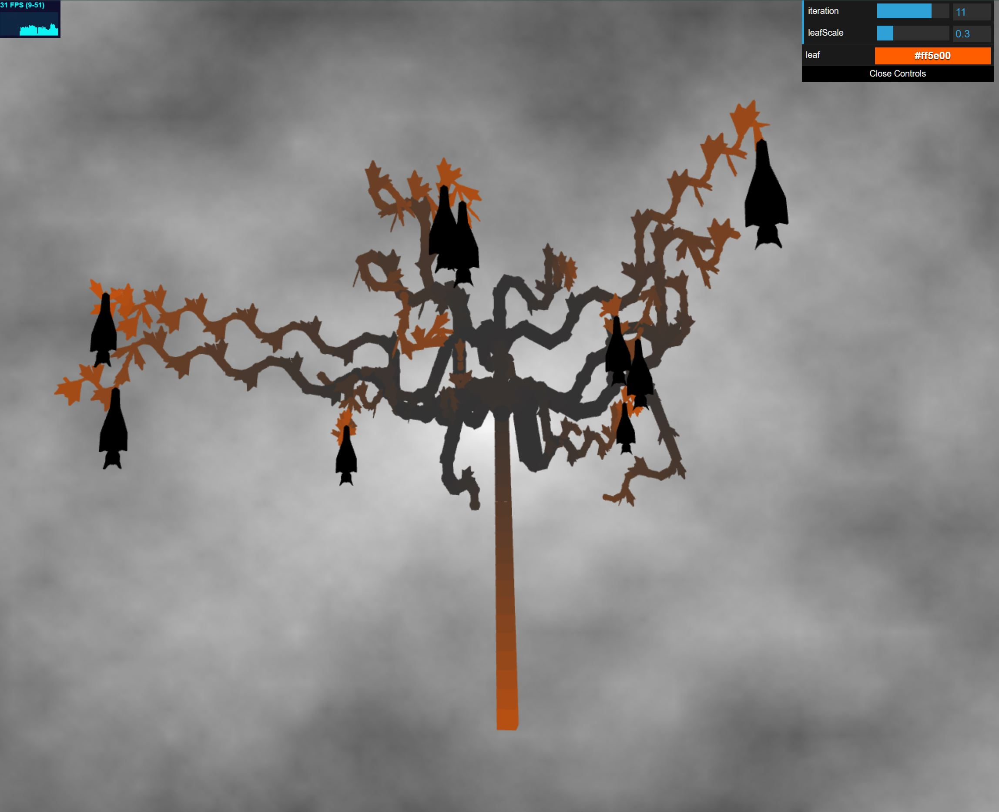

## Halloween Tree:

PennKey: effieli  
Name: Effie Li
Link: https://effieyanfei.github.io/hw04-l-systems/  
I was inspired by Halloween and created a tree with sprial monster-like branches. The leaves are towards the tip of the branches, increasing based on how close it is to the tip. There are also bats hanging from the branches when you incrase the iteration. Users can control the number of iteration, the scale of the leaves, and the color of the leaves and the base of the trunk. The background is created with fbm noise, and it is animated with time.

